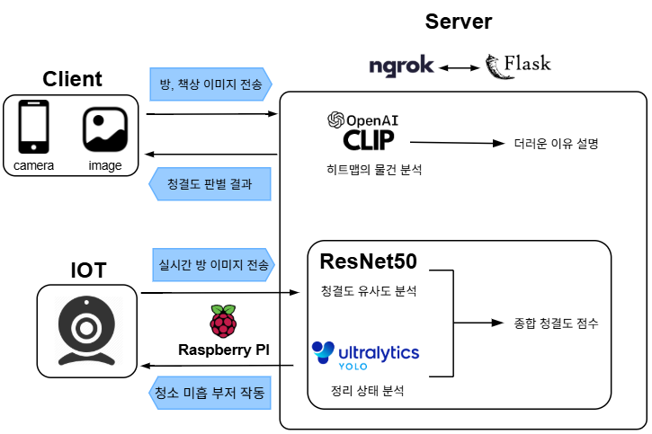
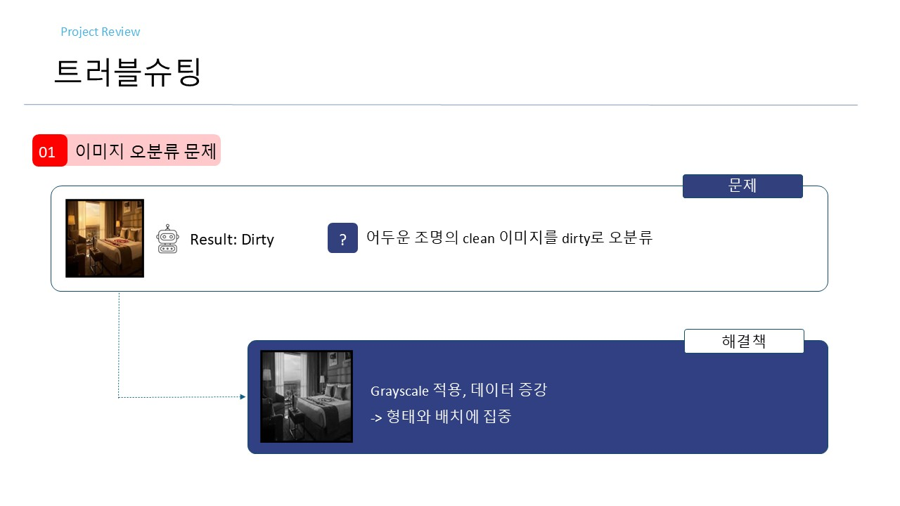
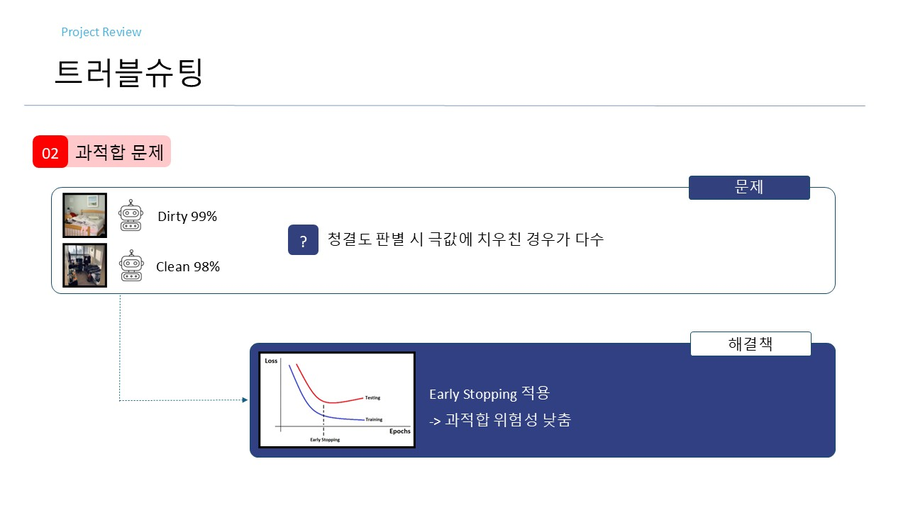
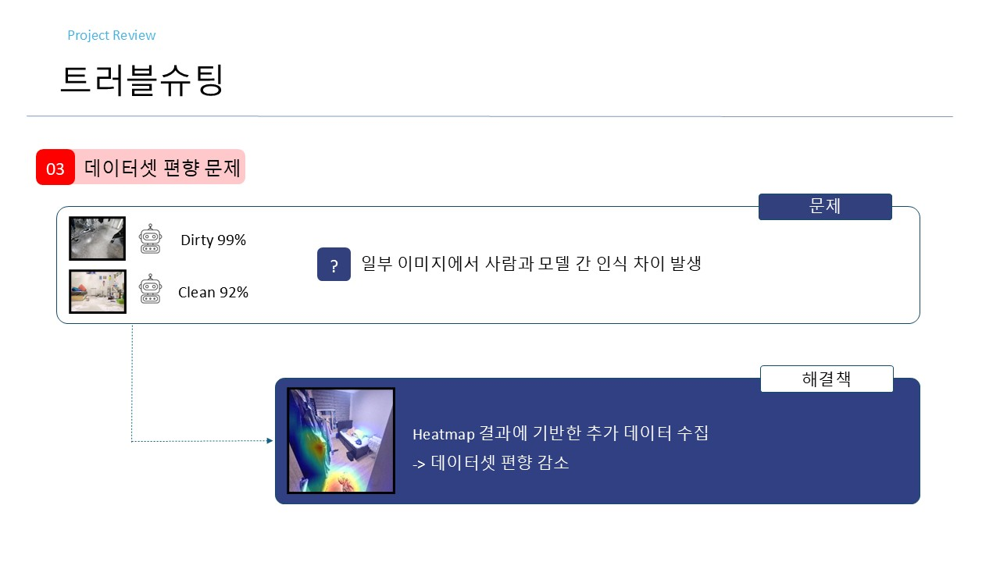

# 방 청결도 분석 서비스
> 사용자가 웹 페이지에서 촬용한 방 사진을 AI가 분석하여 청결 상태를 판단하고 점수로 제공하는 서비스
## 📌 프로젝트 개요
### 수행 기간
> 2026.03.06 ~ 2026.03.20  
### 팀원
> | 기술 | 설명 |
> |----------|------------|
> | 김병현 | YOLO 모델 구현, 웹사이트 프론트/백앤드 |
> | 김권 | PM, Keras 모델 구현 |
> | 김동석 | 데이터셋 수집, 검증, 라즈베리파이 구현 |
> | 명지훈 | Keras Heatmap 구현, CLIP 모델 구현 |

### 배경
> 1인 가구 증가에 따라 많은 사람들이 청소를 미룬다. 청소 타이밍을 놓치게 되면 방은 엉망이 되기 때문에 방 상태의 기준을 세워 방 청소에 도움이 되고자 한다.  
### 목표
  > - 정리 구역 시각화  
  > - 객관적 청결 지수 수립  
### 주요 기능
  > - 청결도 점수화 (ResNet50)
  > - dirty 구역 시각화(Grad-CAM) 및 객체 분포 분석(YOLO)
  > - 방 상태 요약(CLIP)

## 🔧 기술 스택
| 기술 | 설명 |
|----------|------------|
| Python | 전체 시스템 및 AI 모델 개발 |
| Pytorch, TensorFlow,OpenAI CLIP| 이미지를 학습하여 청결도를 분류하는 딥러닝 모델 학습 |
| OpenCV | 이미지 로드, 크기 조정, 전처리 수행 |
| Flask | AI 모델을 제공하는 웹 서버 실행 |
| MYSQL | 커뮤니티 데이터베이스 관리 |

## ⚙️ 시스템 아키텍처

## 💾 데이터

    
자세히

  
### 1️⃣ 수집
> - Python을 사용한 방/책상 사진 웹 크롤링  
> - 사람, 워터마크 등 포함된 이미지 제거  
> - 이미지 데이터 : https://drive.google.com/drive/folders/1xH8Oj7zAddebDz-nC4Pb0cQJk2OXOPtT?usp=drive_link  
### 2️⃣ 전처리
> - 이미지 표준화 : 해상도 256px * 256px, jpg 포맷  
> - 데이터 증강 (회전, 반)  
> - gray scale 적용  
### 3️⃣ 라벨링
> - clean  
> - dirty  
> - 판단 기준 : 논문(DOI : 10.1017/S1041610209990135) 참고  

## 🎥 시연
  
  
  
  

## 🚨 트러블슈팅
### 1️⃣ 이미지 오분류 문제

#### 문제
> dirty 학습 데이터에 어두운 이미지가 많아 어두운 조명의 clean 이미지를 dirty로 오분류하는 문제 발생
#### 해결방법
> Grayscale 적용하여 데이터를 증강함  
> 색상에 집중하기보다 형태와 배치에 집중하고자함
### 2️⃣ 과적합 문제

#### 문제
> 청결도 판별 시 퍼센트가 극값에 치우친 경우가 많음(과적합)
#### 해결방법
> Early Stopping을 적용하여 과적합 위험성을 낮춤
### 3️⃣ 데이터셋 편향 문제

#### 문제
> 일부 이미지에서 사람과 모델 간 청결도 인식 차이 발생
#### 해결방법
> Heatmap 결과에 기반한 추가 데이터를 수집하여 데이터셋 편향을 감소시킴

